# ArgoCD Repository

This repository contains the configuration files and manifests for deploying applications using ArgoCD.

## Table of Contents
- [Introduction](#introduction)
- [Prerequisites](#prerequisites)
- [Installation](#installation)
- [Usage](#usage)
- [Contributing](#contributing)
- [License](#license)

## Introduction
ArgoCD is a declarative, GitOps continuous delivery tool for Kubernetes. This repository helps you manage your Kubernetes applications with ArgoCD.

## Prerequisites
- Kubernetes cluster
- ArgoCD installed on the cluster
- kubectl configured to interact with your cluster

## Step 1: Create a Jenkins Server

1. Create a jenkins server
2. Connect to the server via SSH client

#### Clone the repository

```sh
git clone https://github.com/Gerardbulky/flask-argocd-project.git
cd flask-argocd-project/resume-app
```

#### Install Docker

```sh
sudo apt update
sudo apt install docker.io -y
sudo usermod -aG docker ubuntu
sudo systemctl restart docker
sudo chmod 777 /var/run/docker.sock
```

```sh
docker --version
```

#### Build Docker Image

```sh
docker build -t flask-resume-image:v1 .
```

#### Run Docker Image

docker run -d -p 5000:5000 -t flask-resume-image:v1

Open port 5000 in your Security Group and access your application with the publicIP:5000

### Install and Setup Jenkins

```sh
sudo apt update
sudo apt install openjdk-17-jre -y
java -version

curl -fsSL https://pkg.jenkins.io/debian-stable/jenkins.io-2023.key | sudo tee \
  /usr/share/keyrings/jenkins-keyring.asc > /dev/null

echo "deb [signed-by=/usr/share/keyrings/jenkins-keyring.asc] \
https://pkg.jenkins.io/debian-stable binary/" | sudo tee \
/etc/apt/sources.list.d/jenkins.list > /dev/null

sudo apt update
sudo apt install jenkins -y
sudo systemctl enable jenkins
sudo systemctl start jenkins
sudo usermod -aG docker jenkins

# Check Jenkins service status
sudo systemctl status jenkins --no-pager
```

Get the Jenkins Password

```sh
sudo cat /var/lib/jenkins/secrets/initialAdminPassword
```

Add port 8080 in your security group and access your jenkins using PublicIP:8080

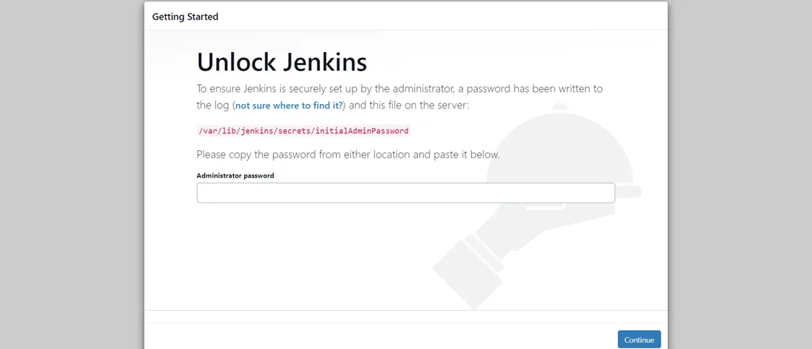

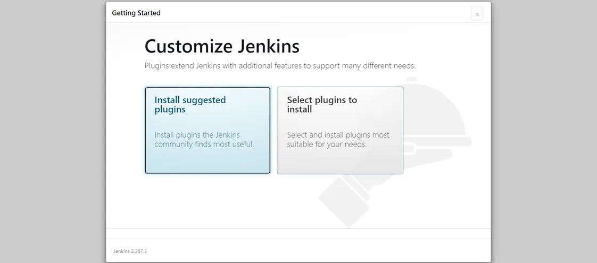

After completing the installation of the suggested plugin you need to set the First Admin User for Jenkins

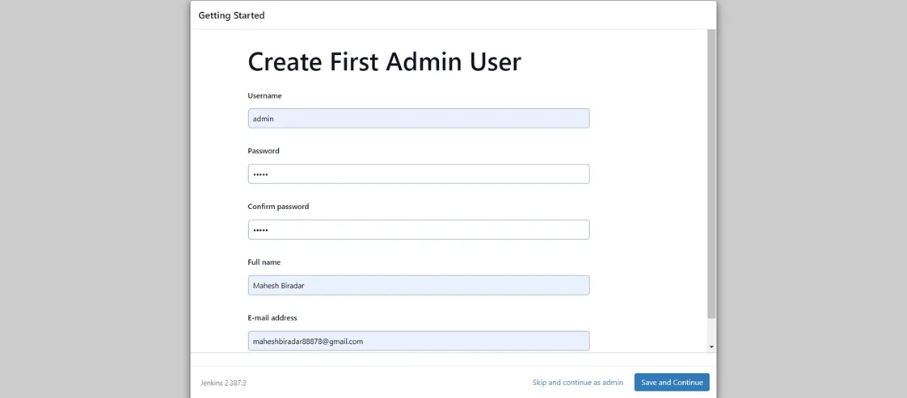

Click **Save and Continue**, **Save and Finish** And now your Jenkins is ready for use.

Click on **New Item**

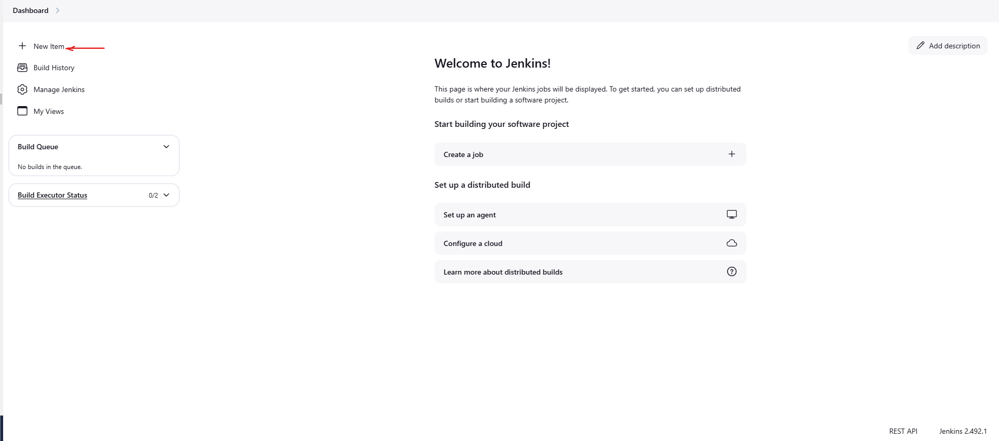

Add the name of your project, and select **Pipeline** and click **OK**.

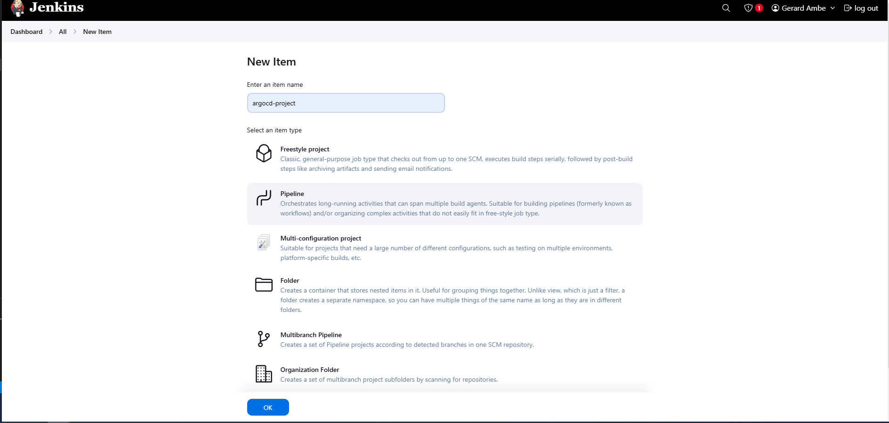

We'll connect Jenkins to GitHub using the GitHub Webhook.  Select **GitHub hook trigger for GITScm polling** to enable the GitHub hook trigger. 

Select **Pipeline Script from SCM** because we have configured our  **Jenkinsfile** in our GitHub repository.

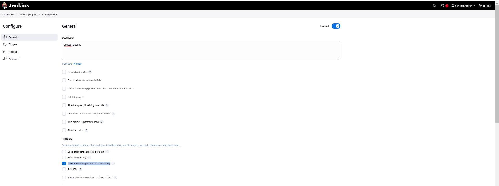
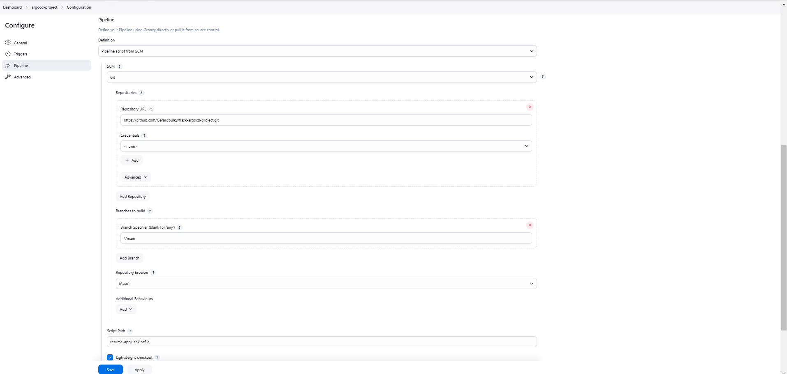

Now, lets Install the necessary Jenkins plugins.

To install the Plugins, go to the Jenkins Dashboard ==> Manage Jenkins ==> Plugins ==> Available plugins

Plugins to installed.
  ```sh
Docker
Docker Commons
Docker Pipeline
Hashicorp Vault pipeline
Pipeline: GitHub
Generic Webhook Trigger
```

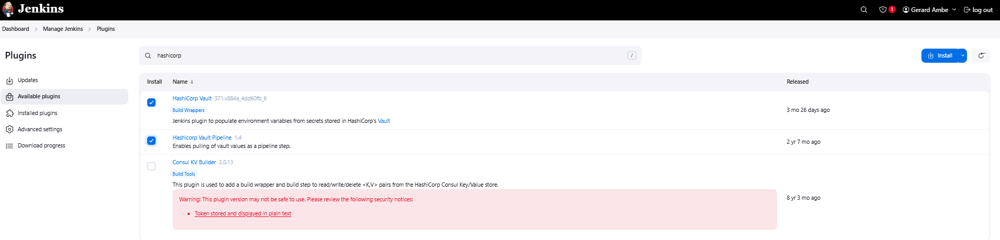


### Install and setup Vault

```sh
wget -O - https://apt.releases.hashicorp.com/gpg | sudo gpg --dearmor -o /usr/share/keyrings/hashicorp-archive-keyring.gpg
echo "deb [arch=$(dpkg --print-architecture) signed-by=/usr/share/keyrings/hashicorp-archive-keyring.gpg] https://apt.releases.hashicorp.com $(lsb_release -cs) main" | sudo tee /etc/apt/sources.list.d/hashicorp.list
sudo apt update
sudo apt install vault
```

Run the below command to start the vault in the background

```sh
nano vault_config.hcl
```
```sh
storage "file" {
  path = "./vault/data"
}

listener "tcp" {
  address     = "0.0.0.0:8200"
  tls_disable = "true"
}

disable_mlock = true
api_addr     = "http://127.0.0.1:8200"
cluster_addr = "https://127.0.0.1:8201"

ui = true
```
Run the command below to create the ./vault/data directory. 

```sh
mkdir -p ./vault/data
```
Run vault in the background

```sh
nohup vault server -config=vault_config.hcl > vault.log 2>&1 &
```
Verify Vault is Running

```sh
ps aux | grep vault
```

Set VAULT_ADDR environment variable

```sh
export VAULT_ADDR='http://127.0.0.1:8200'
```

To initialize Vault use vault operator init

```sh
vault operator init -key-shares=1 -key-threshold=1
```
Copy the **Unseal Key** and **Initial Root** and paste on a nodepad. 

```sh
export VAULT_TOKEN=<root token>
```

```sh
vault operator unseal
```
Paste the **Unseal Key**

Finally, authenticate as the initial root token (it was included in the output with the unseal keys).

```sh
vault login <root token>
```

Go to **IP Address:8200** — Shows the UI of the HashiCorp Vault Page

```sh
vault auth enable approle
```

Create a named role:

```sh
vault write auth/approle/role/jenkins-role \
token_num_uses=0 \
secret_id_num_uses=0 \
policies="jenkins"
```


<!-- To access the vault from the console, you need to have a Token which is stored in the vault.log file that is created by running on above command
```sh
cat vault.log | tail -10
```

Now, Access the Vault GUI by copying the Public IP of the Vault Server with port 8200 and pasting the copied Root token

Now, export the vault address by running the below command
  ```sh
export VAULT_ADDR='http://0.0.0.0:8200'
```

Now, enable the approle to create the role
```sh
vault auth enable approle
```
Create Secrets in Vault
Enable Secrets where path = “secrets” and it will using key value pair
```sh
vault secrets enable -path=secrets kv-v2
```

Now, create the policy where we specify that the path of the secret can be only read by the app role

```sh
vault policy write jenkins - <<EOF
path "secrets/data/*" {
capabilities = ["read"]
}
EOF
```

Now, create the approle and associate it with the policy that we have created above

Create a named role:
```sh
vault write auth/approle/role/jenkins \
secret_id_ttl=0 \
token_num_uses=60 \
token_ttl=0 \
token_max_ttl=0 \
secret_id_num_uses=60 \
token_policies=jenkins
``` -->

Now, we need the role ID which will help us to integrate with Jenkins
```sh
vault read auth/approle/role/jenkins-role/role-id
```

Get a SecretID issued against the AppRole:
```sh
vault write -f auth/approle/role/jenkins-role/secret-id
```

Install Vault Plugin & Integrate vault with Jenkins:
Navigate to **Manage Jenkins** ==> **Plugins** ==> **Available Plugins** ==> Select **Hashicorp Vault Plugins** 


### Integrate vault with Jenkins

Navigate to **Manage Jenkins** ==> **Credentials** ==> **global** ==> Click on **Add Credential** 

Select credential type as **Vault AppRole Credentials** and fill out the role ID, Secret ID, ID, Description and click on **Add**.

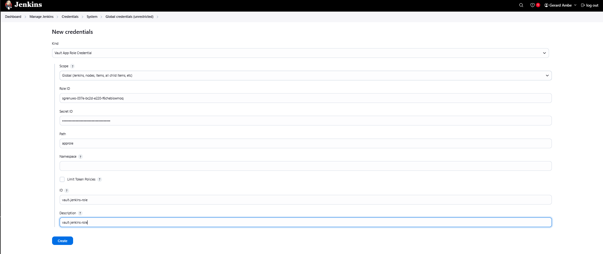

Navigate to **Manage Jenkins** ==> **System**

Under the Vault Plugin, add the Vault URL. Click on the Vault credential dropdown menu to add the Vault credential we created earlier.

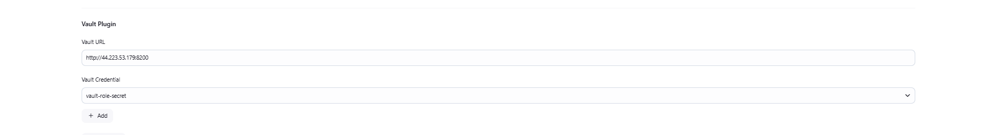

### Create Secrets in Vault
Enable Secrets where path = "secrets" and it will using key value pair

```sh
vault secrets enable -path=secrets kv
```

Write a Secret in Vault at path “secrets/creds/secret-text” with key as secret and value as jenkins123

```sh
vault kv put secrets/creds username="bossmanjerry"
```
We now create a policy to give permission to approle to retrieve secrets

```sh
vi jenkins-policy.hcl
```
```sh
path "secrets/creds/*" {
    capabilities = ["read"]
} 
```

Create a policy named “jenkins” and use “jenkins-policy.hcl” as its content

```sh
vault policy write jenkins jenkins-policy.hcl
```


In other for Jenkins to access our credentials, we need to provide the Path to where the secret are stored in Hashicorp Vault.

Navigate to **Manage Jenkins** ==> **Credentials** ==> ***Global*** ==> Click on **add credential**, Select **Vault Secret Text Credentials** and add the Path of the Secrets stored in Vault. Click the **Test Vault Secrets retrival** to check if jenkins can retrieve secrets from Hashicorp Vault. 


### Helpful commands
If you lost the Vault token, run the command: **cat ~/.vault-token**
To stop vault running in the background: **ps aux | grep vault** then **sudo pkill -9 vault**


## Step 2: Create an EKS Server
On the console, search for EC2. Then click on **Launch Instance**.
Now, we need a create an EKS instance. Provide the information as shown below:

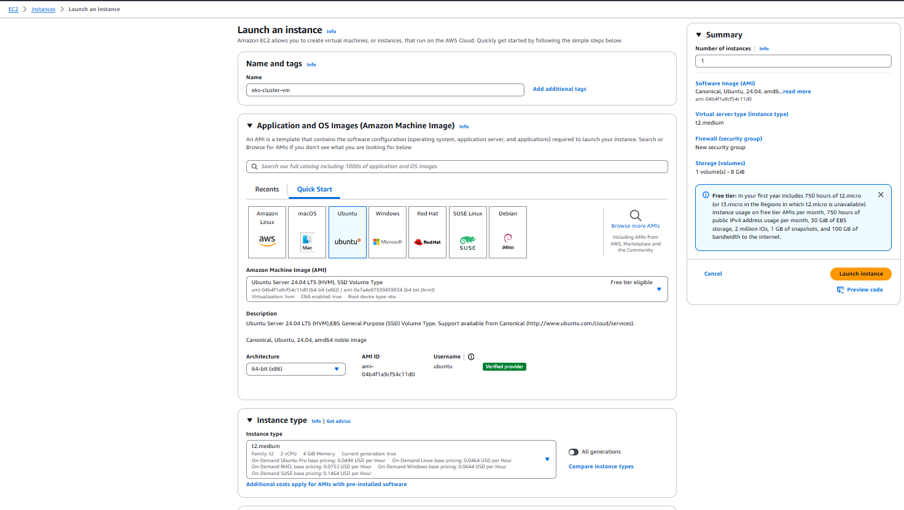
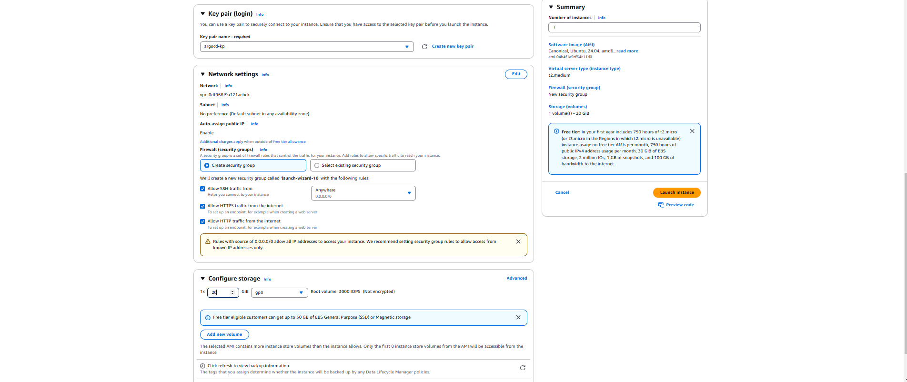

Now click on **Launch Cluster** to create your instance. 
If you go to the instance console, you will see that your instance has been created.

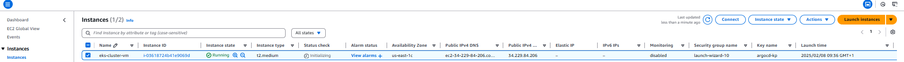

Click on the instance

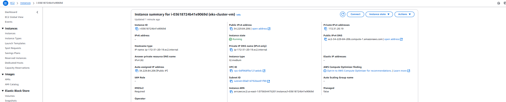

From here we will create an **IAM Role**
Click on **Action**, **Security**, **Modify IAM role**

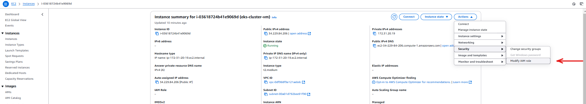

Now, click on **Create new IAM role** 

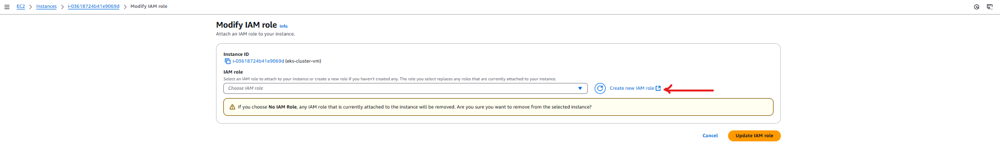

Click on **Create role**

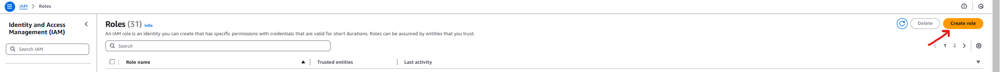

Provide the information as shown below and click on **Next**.

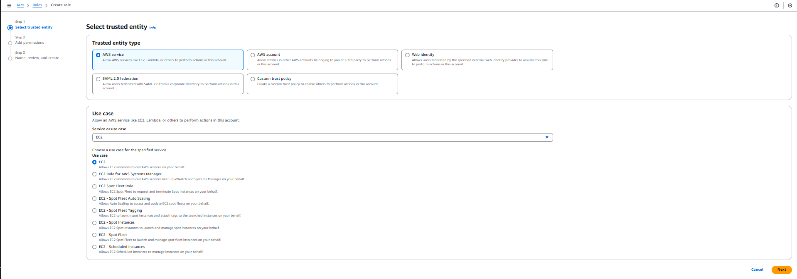

Add the permissions, select **AdministratorAccess**, **AmazonEKSClusterPolicy**, **AmazonEKSServicePolicy**, then click on **Next**

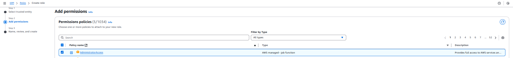

Now, provide the Role name and click on **Create role**

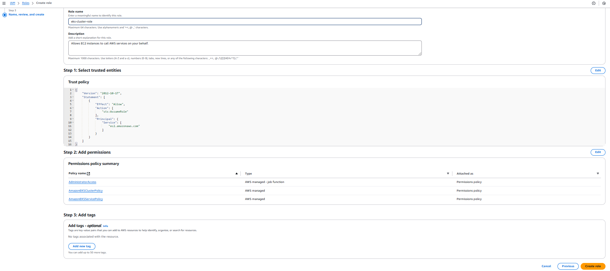

Click on the refresh button, select the IAM role from the dropdown menu, then click on **Update IAM role**.

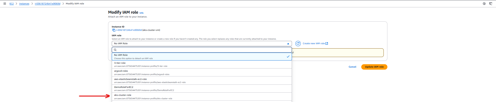

Now we need to connect to our EKS instance from the CLI.
Navigate to EC2 instance console and select the instance and click on the **Connect**.


We will connect to the Instance using **SSH client**.

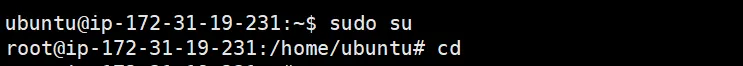

## Install AWS CLI:

```sh
sudo apt update
sudo apt install -y unzip curl
curl "https://awscli.amazonaws.com/awscli-exe-linux-x86_64.zip" -o "awscliv2.zip"
unzip awscliv2.zip
sudo ./aws/install 
aws --version
```

## Install Docker:

```sh
apt-get install docker.io 
usermod -aG docker $USER jenkins
newgrp docker 
sudo chmod 777 /var/run/docker.sock
docker --version
```

## Install Kubectl:

```sh
sudo apt update
curl -LO "https://dl.k8s.io/release/$(curl -L -s https://dl.k8s.io/release/stable.txt)/bin/linux/amd64/kubectl"
chmod +x ./kubectl
sudo mv ./kubectl /usr/local/bin/kubectl
kubectl version --client
```

## Install eksctl:

```sh
sudo curl --silent --location "https://github.com/weaveworks/eksctl/releases/latest/download/eksctl_$(uname -s)_amd64.tar.gz" | sudo tar xz -C /usr/local/bin
```
```sh
eksctl version
```

## Create Kubernetes Cluster on Amazon EKS:

```sh
eksctl create cluster --name argocd-eks-cluster --region us-east-1 --nodegroup-name argocd-cluster-nodes --node-type t2.medium --nodes 2 --nodes-min 1 --nodes-max 4 --managed --zones us-east-1a,us-east-1b
```

Run the command to check all clusters created in a specific region:

```sh
eksctl get clusters --region us-east-1
```

## Connect to the cluster:
This command is used to update the Kubernetes configuration (kubeconfig) file for an Amazon Elastic Kubernetes Service (EKS) cluster named "argpcd-eks-cluste" in the "us-east-1" region, allowing you to interact with the cluster using **kubectl**

```sh
aws eks update-kubeconfig --name argocd-eks-cluster --region us-east-1
```

Check the nodes:

```sh
kubectl get nodes
```


## Step 3: We need to create an IAM user and generate the AWS Access key

Create a new IAM User on AWS and give it to the AdministratorAccess for testing purposes (not recommended for your Organization's Projects)

Go to the AWS IAM Service and click on Users.

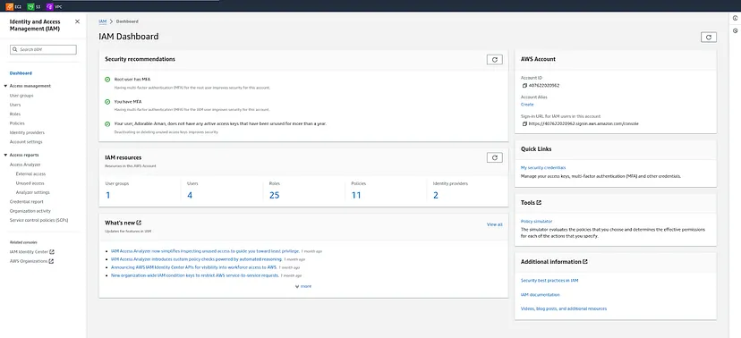

Click on Create user

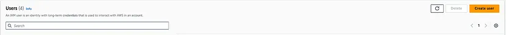

Provide the name to your user and click on Next.

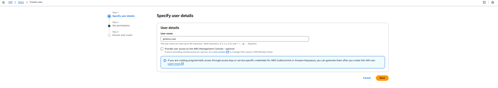

Select the **Attach policie**s directly option and search for **AdministratorAccess** then select it.

Click on the Next.

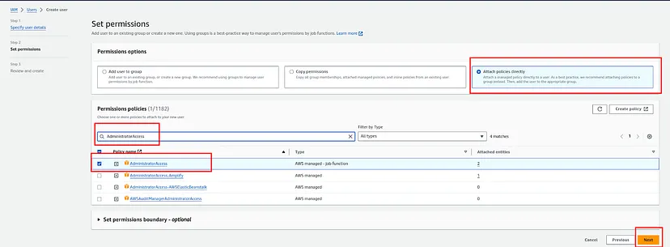

Click on Create user

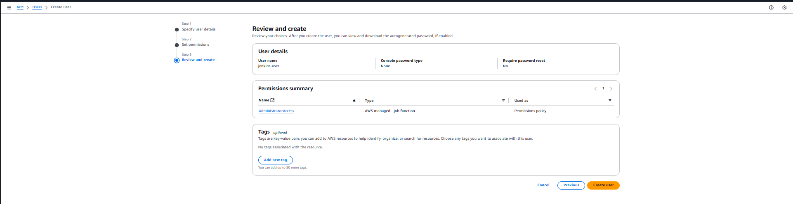

Now, Select your created user then click on **Security credentials** and generate access key by clicking on **Create access key**.

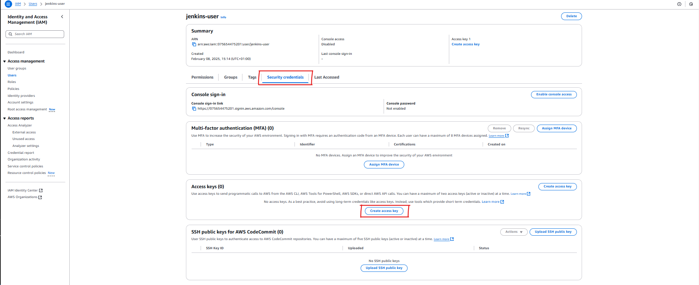

Select the **Command Line Interface (CLI)** then select the checkmark for the confirmation and click on **Next**.

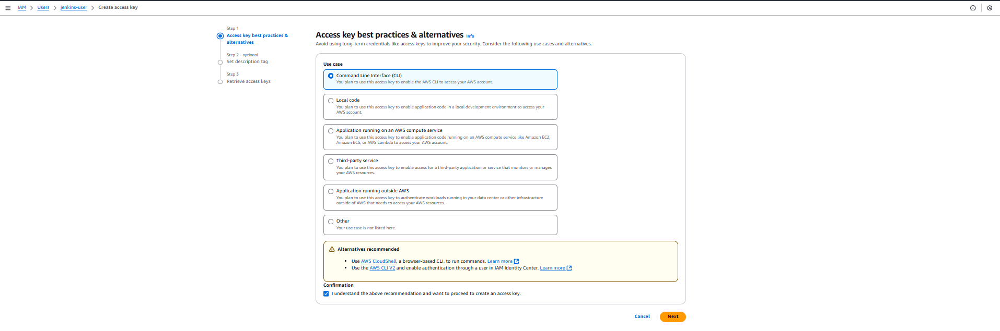

Provide the Description and click on the Create access key.

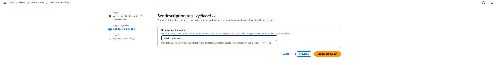

Here, you will see that you got the credentials and also you can download the CSV file for the future.


## Delete the EKS cluster using eksctl:
```sh
eksctl delete cluster --name argocd-eks-cluster --region us-east-1
```
```sh
aws cloudformation delete-stack — stack-name eksctl-my-cluster-cluster — region us-east-1
```
## Useful Links
Helpful in creating EKS from Windows CLI: https://www.youtube.com/watch?v=0bUEKcjC_jM&list=PLeP7Id1yoQRvzDo5NtE0l3nOqNTKtZSWu&index=1


1. Clone the repository:
    ```sh
    git clone https://github.com/yourusername/argocd-repo.git
    cd argocd-repo
    ```

2. Apply the ArgoCD manifests:
    ```sh
    kubectl apply -f manifests/
    ```

## Usage
1. Sync the application:
    ```sh
    argocd app sync <app-name>
    ```

2. Check the application status:
    ```sh
    argocd app get <app-name>
    ```


## Contributing
Contributions are welcome! Please open an issue or submit a pull request.

## License
This project is licensed under the MIT License. See the [LICENSE](LICENSE) file for details.